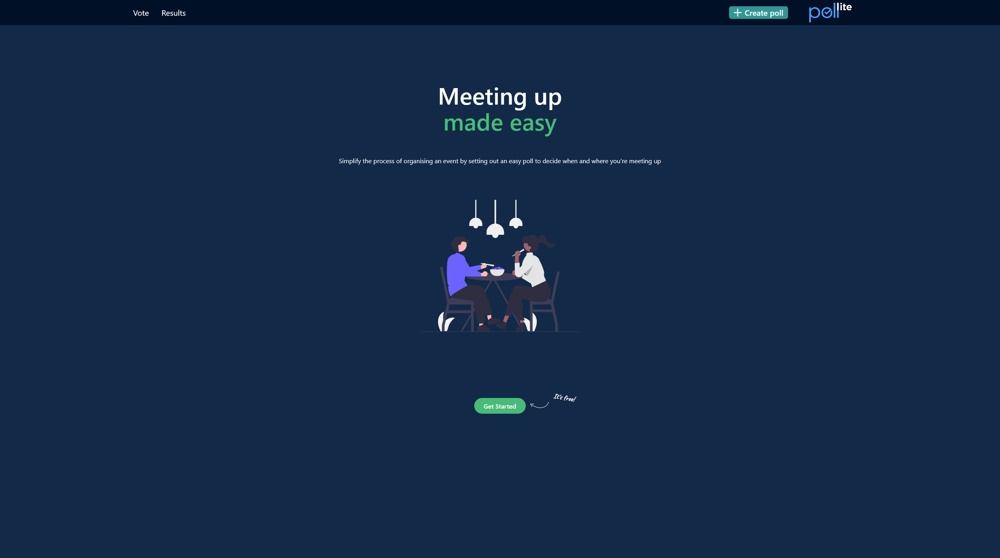
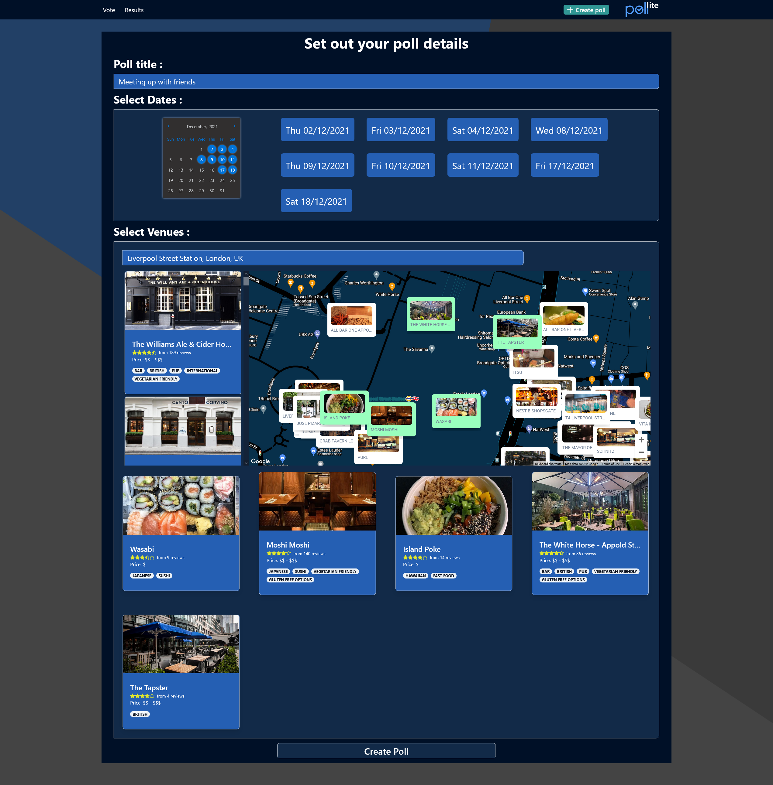
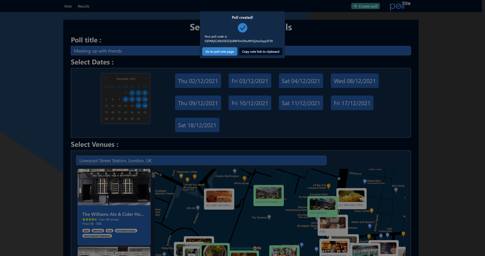
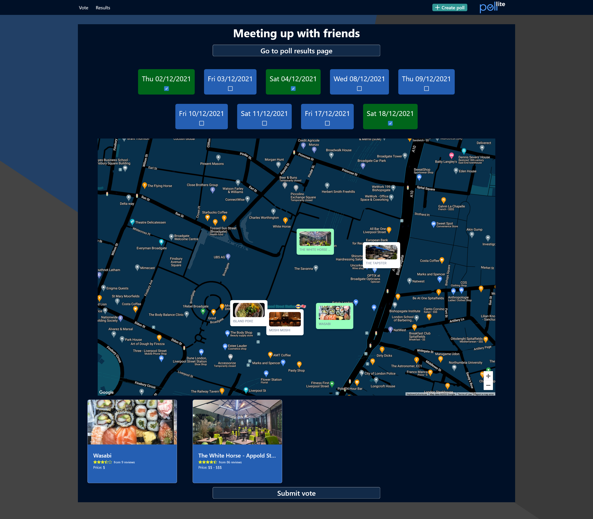
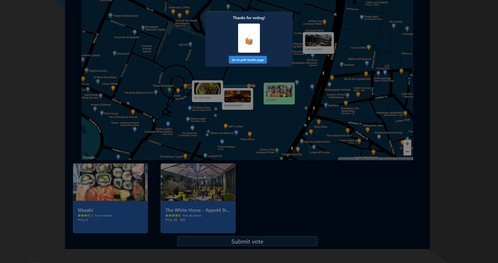
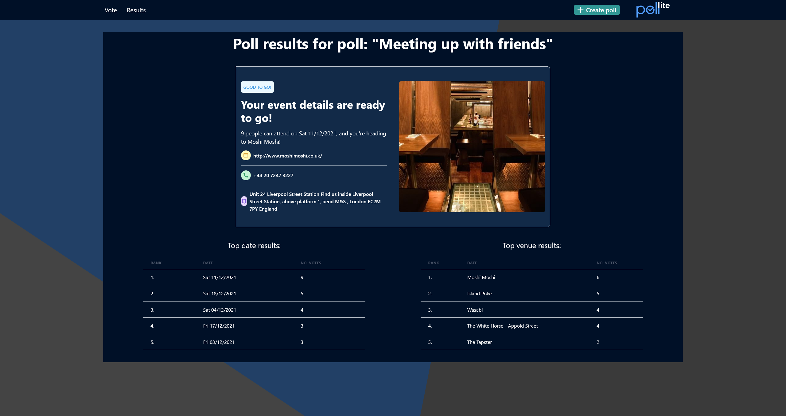

# Pollite

## What is Pollite?

Pollite is a website designed to make life easier for the organisers of the world. It provides an easy way of creating a poll to set out the date and place for an event, with a unique link code which can be provided to other users for them to vote on their date/venue choices.

Users can go to that unique link, and choose from the choices decided upon by the host, as well as the different date options.

Once the poll has been voted on, the results are given to users, telling them exactly where they're going, on what date, and how many people can attend.

A walkthrough video for the website can be found at https://youtu.be/g7kXuq2Uveg

## Tech Stack

Pollite makes use of NextJS for both the Front and Back end. The Front end has been created using Chakra UI components, and data for the polls and responses is stored on a MongoDB database, accessed through Mongoose. The app also makes use of interaction with the Google Maps and Google Places platform, as well as grabbing relevant venue information from the RapidAPI Travel Advisor API.

## Getting Started

Pollite is easy to deploy on your own computer - it uses NextJS for the Front and Back End, so using the command 'npm run dev' from the project root will run the full application.

However, you will need to create a .env.local file with the full details provided by the .env.example file, including:

- A RapidAPI key for the TravelAdvisor API (https://rapidapi.com/apidojo/api/travel-advisor/)
- A Google Maps and Google Places key (combined)
- Your MongoDB database location
